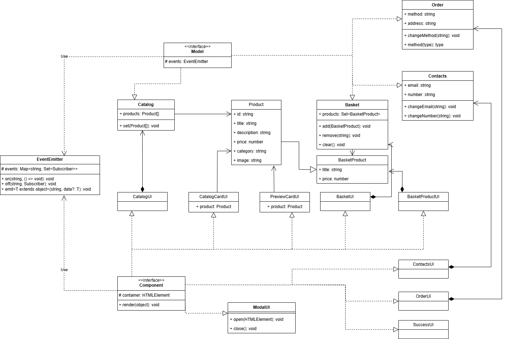

# Проектная работа "Веб-ларек"

## Стек
- HTML
- SCSS
- Ts
- Webpack

## Структура проекта:
- src/ — исходные файлы проекта
- src/components/ — папка с JS компонентами
- src/components/base/ — папка с базовым кодом

## Важные файлы:
- src/pages/index.html — HTML-файл главной страницы
- src/types/index.ts — файл с типами
- src/index.ts — точка входа приложения
- src/scss/styles.scss — корневой файл стилей
- src/utils/constants.ts — файл с константами
- src/utils/utils.ts — файл с утилитами

## Установка и запуск
Для установки и запуска проекта необходимо выполнить команды

```
npm install
npm run start
```

или

```
yarn
yarn start
```
## Сборка

```
npm run build
```

или

```
yarn build
```

## Базовые классы

### Класс `EventEmitter`

Реализует паттерн «Наблюдатель» и позволяет подписываться на события и уведомлять подписчиков
о наступлении события.
Класс имеет методы `on`, `off`, `emit` — для подписки на событие, отписки от события и уведомления
подписчиков о наступлении события соответственно.

### Абстрактный класс `Model`

Представляет собой класс, от которого наследуется все модели в приложении. Содержит логику работы с событиями.

Класс содержит поля:
- `events` - экземпляр класса `EventEmitter`

### Абстрактный класс `Component`

Представляет собой класс, от которого наследуется все отображения в приложении. Содержит логику отрисовки элементов с заданными параметрами.

Класс содержит поля:
- `container` - элемент, внутри которого будут происходить все изменения при отрисовки

Класс реализует методы:
- `render` - отрисовка элемента с заданными параметрами

### Класс `Catalog` 

Реализует логику работы со списком продуктов, отображающихся на странице.

Класс содержит поля:
- `products` - список товаров в каталоге

Класс реализует методы:
- `set` - установка списка товаров (для загрузки с сервера)

### Класс `CatalogUI`

Класс, отвечающий за отрисовку каталога

### Класс `Basket`

Реализует логику работы с корзиной

Класс содержит поля:
- `products` - список товаров в корзине

Класс реализует методы:
- `add` - добавление элемента в корзину
- `remove` - удаление элемента из корзины по id
- `clear` - очистка корзины от всех элементов

### Класс `BasketUI`

Класс, отвечающий за отрисовку корзины

### Класс `CatalogCardUI`

Класс, отвечающий за отрисовку карточки товара в каталоге

Класс содержит поля:
- `product` - отрисованный товар

### Класс `PreviewCardUI`

Класс, отвечающий за отрисовку карточки товара в модальном окне при клике на соответствующую карточку в каталоге

Класс содержит поля:
- `product` - отрисованный товар

### Класс `BasketProductUI`

Класс, отвечающий за отрисовку элемента корзины

### Класс `Order`

Класс, отвечающий за работу с такими данными при заказе, как метод оплаты и адрес доставки

Класс содержит поля:
- `method` - метод оплаты, выбранный пользователем
- `address` - указанный адрес доставки заказа

Класс реализует методы:
- `changeMethod` - изменение метода оплаты
- `changeAddress` - изменения адреса доставки

### Класс `OrderUI`

Класс, отвечающий за отрисовку модального окна с данными для заказа

### Класс `Contacts`

Класс, отвечающий за работу с контактными данными пользователя при оформлении заказа

Класс содержит поля:
- `email` - электронная почта
- `number` - телефонный номер

Класс реализует методы:
- `changeEmail` - изменение электронной почты
- `changeNumber` - изменения телефонного номера

### Класс `ContactsUI`

Класс, отвечающий за отрисовку модального окна с выбором контактных данных

### Класс `SuccessUI`

Класс, отвечающий за отрисовку модального окна с подтверждением заказа и итоговой стоимость

### Класс `ModalUI`

Класс, отвечающий за работу с модальными окнами

Класс реализует методы:
- `open` - открытие модального окна с указанным контентом
- `close` - закрытие модального окна

## Основные типы данных

### `Product`
- `id` - уникальный идентификатор товара
- `title` - название товара
- `description` - описание товара
- `price` - цена товара
- `category` - категория товара
- `image` - ссылка на изображение товара

### `BasketProduct`
Обобщающий тип `Product`, используемый для работы с элементами корзины
- `id`
- `title`
- `price`

## UML


## Архитектура

В приложении используется `Event Driven` архитектура, завязанная на событиях и их обработчиках, за работу которых отвечает класс `EventEmitter`